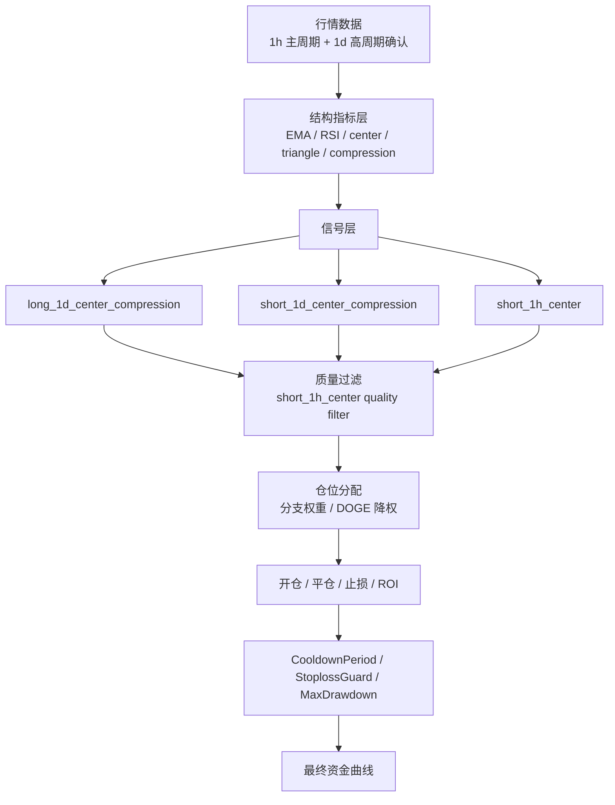
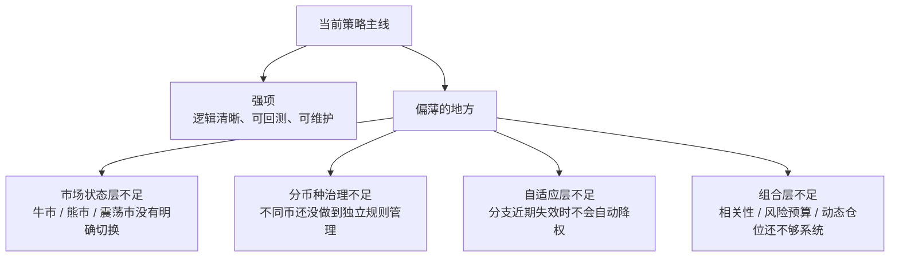

# 策略架构说明

这份文档用于说明当前主线策略大致由哪些层组成、哪些部分已经比较完整、哪些部分还比较薄。

## 当前目录结构

```text
strategies/
  myStrage/                                # 现役主策略集合
    Top9MainTrendStrategy.py              # 主版本
    Top9MainReversal193Strategy.py         # 193 风格固定版
    Top9MainReversalZec216Strategy.py      # 216 风格 ZEC 版
    Top9MainReversal216ShortAggressiveStrategy.py  # 216 收益优先版
  run/                                     # 当前运行的实盘 / 测试实盘
    Top9Main60UTestLiveStrategy.py
  test/                                    # 其他实验 / 历史 / 对照策略
  entrypoints/                           # 真正的策略实现入口层
  core/                                  # 市场状态 / 指标 / 风控通用层
  signals/                               # 买卖信号层
  pairs/                                 # 分币种特殊逻辑层
  shared/                                # 公共常量与共享配置
  research/                              # 研究笔记、审计样本、K线导出
  archive/                               # 历史版本与实验版本归档
  docs/                                  # 说明文档
```

### 分层职责

- `myStrage/`
  - 放当前主策略集合
  - 只保留主版本、193 反转固定版、216 反转版、216 收益优先版
- `run/`
  - 放当前正在运行的实盘 / 测试实盘入口
- `test/`
  - 放其它实验性、对照性或历史策略
  - 已退役的策略不再保留可执行入口，只保留研究笔记与回测结果
- `entrypoints/`
  - 放可直接被 Freqtrade 加载的入口类
- `core/`
  - 放市场状态、指标、风控、仓位等通用逻辑
  - 适合未来继续拆分日线状态、小时级状态、保护机制
  - 当前已经拆出的指标模块：
    - `core/indicators/structure.py`
- `signals/`
  - 放 long / short 的入场、出场、持有逻辑
  - 适合把“信号”和“过滤”从策略入口里剥离
  - 当前已经拆出的模块包括：
    - `signals/long/entries.py`
    - `signals/short/entries.py`
    - `signals/reversal.py`
    - `signals/exit_rules.py`
    - `signals/filters.py`
- `pairs/`
  - 放 BTC / ETH / ZEC 等分币种差异逻辑
  - 某个币有特殊阈值、特殊 exit、特殊 stake 时优先放这里
  - 当前已经显式建档的币种 profile：
    - `pairs/btc/profile.py`
    - `pairs/eth/profile.py`
    - `pairs/zec/profile.py`
- `shared/`
  - 放全局复用的常量、白名单、币种分组、工具函数
- `archive/`
  - 放历史峰值版本、实验版本、临时调试版本
- `research/`
  - 放研究笔记、样本审计、原始 K 线导出
  - 当前 ZEC 1h 反转突破研究已经迁入这里
  - 震荡策略的最终研究笔记也已迁入这里

## 文件存放规则

策略文件的更细粒度存放规则统一记录在：

- [`FILE_PLACEMENT_RULES.md`](D:/test/ft_userdata/user_data/strategies/FILE_PLACEMENT_RULES.md)

编辑策略文件前，必须先读这份规则文件。

### 当前落地状态

- `entrypoints/` 已经独立出来，策略入口只负责组装 / 转发
- `shared/` 已开始承载共用币种分组
- 现役主策略已移入 `myStrage/`
- 当前运行的测试实盘策略已移入 `run/`
- 其它历史 / 实验策略已移入 `test/`
- 历史与实验文件已优先归档到 `archive/old_versions/`
- `CombinedTrendCaptureMilestoneV1*` 和 `CombinedTrendCaptureMilestoneV2*`
  这两代历史文件也已归档，不再作为现役根目录文件使用

## 当前主线架构



## 已经具备的层

### 1. 数据层

- 主执行周期：`1h`
- 高周期确认：`1d`
- 不是单周期裸跑，而是多周期结构确认

### 2. 指标层

- 使用了结构型指标，而不是单纯均线金叉死叉
- 主要包括：
  - `EMA`
  - `RSI`
  - `center`
  - `triangle`
  - `compression`
  - `ATR`

### 3. 信号层

目前真正主要赚钱的核心分支主要是：

- `long_1d_center_compression`
- `short_1d_center_compression`
- `short_1h_center`

这也是当前策略收益最集中的来源。

### 4. 过滤层

- 已经对 `short_1h_center` 做过质量过滤
- 说明策略并不是完全裸信号执行，而是已经开始做分支筛选

### 5. 仓位层

- 已有分支仓位权重
- 已有个别币种风险调整，例如 `DOGE` 降权调整

### 6. 出场层

当前不是只靠固定止盈止损，已经包含：

- `ROI`
- `custom_stoploss`
- `structure_exit`
- `swing_exit`
- `trend_flip`

### 7. 组合风控层

目前已启用的 protections 包括：

- `CooldownPeriod`
- `StoplossGuard`
- `MaxDrawdown`

### 8. 震荡策略研究层

震荡高抛低吸策略已经从现役代码中退役，不再作为可执行策略保留。

它的内容现在只保留为：

- 研究说明：`research/range_swing_retired.md`
- 回测结果：`backtest_results/backtest-result-2026-04-14_09-15-20.*`
- 早期结果：`backtest_results/backtest-result-2026-04-14_08-49-57.*`

这部分仅用于以后回看思路，不再作为现役交易入口。

## 为什么说它“比较薄”

这里的“薄”不是说它差，也不是说它太简单不能用。

更准确地说，是：

- 核心逻辑比较集中
- 真正赚钱的主分支不多
- 上层调度和自适应层还不够厚

也就是说：

- 底层信号已经比较清楚
- 但上层系统化管理还不够完整

## 当前还比较薄的层



### 1. 市场状态层不足

当前没有真正明确区分：

- 牛市
- 熊市
- 震荡市
- 高波动风险期

现在更多是同一套主逻辑在不同环境里统一执行。

### 2. 分币种治理不足

虽然已经做过币池筛选，但还没有做到：

- 每个币种独立开关不同分支
- 每个币种独立风险预算
- 每个币种独立阈值控制

### 3. 自适应层不足

还没有形成真正的动态调节机制，例如：

- 某分支近期持续失效时自动降权
- 某币近期恶化时自动停用
- 某类市场环境中自动降低出手频率

### 4. 组合层不足

目前还缺少更成熟的组合控制，例如：

- 相关性约束
- 方向集中度约束
- 风险预算分配
- 动态仓位目标

## 当前复杂度怎么理解

可以粗略理解为：

- 初级策略：单指标、单周期、固定止盈止损
- 当前这套：中级偏上
- 更成熟系统：会再多出市场状态机、分币种治理、自适应风控、组合风险预算

所以现在这套并不简单，但也还不是一个“完整多层交易系统”。

## 后面最值得补厚的 3 层

### 1. 市场状态层

决定什么时候：

- 偏多
- 偏空
- 少做
- 降风险

### 2. 分币种治理层

决定：

- 哪些币适合哪些分支
- 哪些币需要独立降权
- 哪些币近期应该暂停

### 3. 自适应风险层

决定：

- 哪些分支近期失效
- 什么时候自动收缩风险
- 什么时候恢复正常仓位

## 一句话总结

当前这套策略：

- 更像一把已经磨得很锋利的刀
- 还不是很多工具协同运作的一整套工具箱

这也是为什么它当前已经能跑出不错结果，但继续提升会越来越依赖上层系统化能力，而不只是继续调单个参数。
