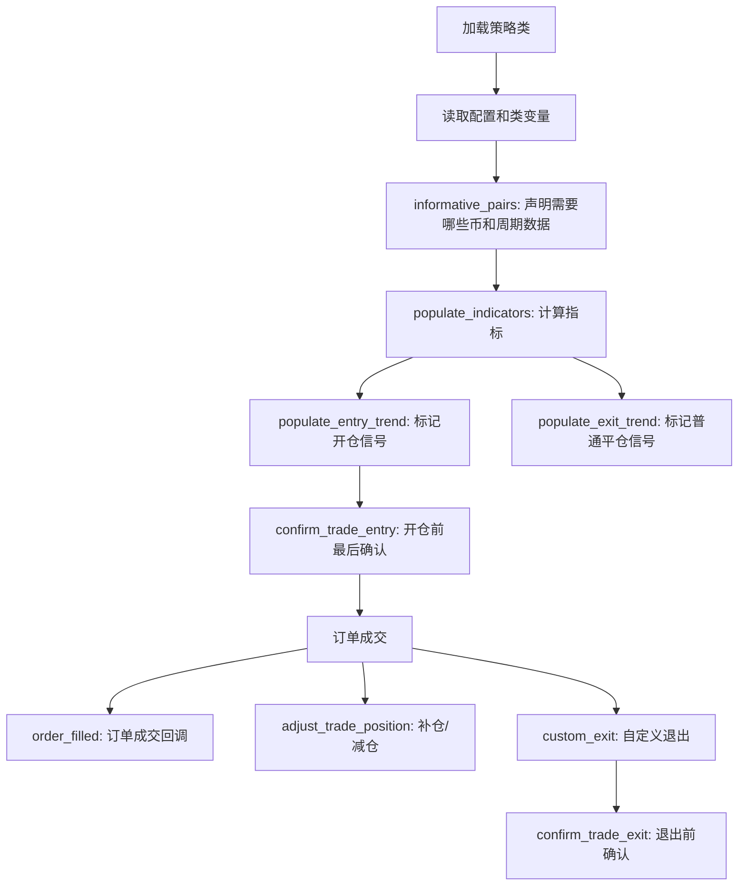
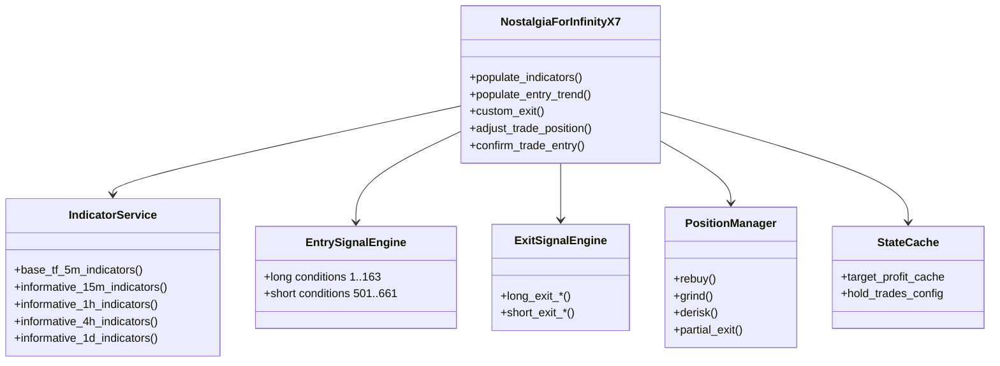

# NostalgiaForInfinityX7 代码学习说明书（Java 开发者版）

源码文件：`D:\test\NostalgiaForInfinity\NostalgiaForInfinityX7.py`

配套索引：[NFI_X7_函数目录_核心方法位置索引.md](./NFI_X7_函数目录_核心方法位置索引.md)

## 0. 先说结论

`NostalgiaForInfinityX7.py` 不是一个普通的短 Python 脚本，它更像一个大型交易系统的“单文件版”。

它包含：

- Freqtrade 策略类
- 多周期指标计算
- 多套开仓模式
- 多套平仓模式
- 多头和空头两套近似镜像逻辑
- 动态仓位调整
- 补仓、网格、减仓、止损、利润追踪
- 状态缓存和文件持久化

如果用 Java 类比，它大概相当于：

```java
public class NostalgiaForInfinityX7 extends IStrategy {
    // 大量 static/final 配置
    // 指标计算 service
    // 开仓规则 engine
    // 平仓规则 engine
    // 仓位调整 engine
    // 风控 engine
    // 状态缓存 repository
}
```

只不过 Python 允许把这些东西都塞在一个 `.py` 文件里。

## 1. 你应该怎样阅读这个文件

不要从第 1 行一路读到第 7 万行。这样会非常痛苦，也不利于理解。

推荐顺序：

1. 先看类配置区：理解策略运行参数
2. 再看 Freqtrade 生命周期函数：理解框架什么时候调用哪些方法
3. 再看指标计算：理解每根 K 线上生成了哪些字段
4. 再看开仓逻辑：理解 `enter_long` / `enter_short` 怎样产生
5. 再看平仓逻辑：理解 `custom_exit` 和各种 `long_exit_*` / `short_exit_*`
6. 最后看仓位调整：理解为什么它能 100% 胜率，也为什么回测可信度要谨慎

## 2. Python 和 Java 对照

| Python 写法 | Java 类比 | 说明 |
| --- | --- | --- |
| `class NostalgiaForInfinityX7(IStrategy)` | `class X extends IStrategy` | 继承 Freqtrade 策略基类 |
| `def xxx(self, ...)` | `public xxx(...)` | 类方法，`self` 类似 Java 的 `this` |
| `self.xxx` | `this.xxx` | 实例字段或方法 |
| `xxx = 123` 写在类里 | 类字段 / 默认配置 | Python 类变量，Freqtrade 会读取这些配置 |
| `DataFrame` | 表格对象 / List<Row> | Pandas 的二维数据表，每行是一根 K 线 |
| `df["RSI_14"]` | `rows.map(row.rsi14)` | 一整列指标数据 |
| `df.loc[condition, "enter_long"] = 1` | 对满足条件的行打标 | Pandas 批量赋值 |
| `Trade.get_trades_proxy()` | 查询当前持仓 repository | Freqtrade 提供的交易状态接口 |
| `Optional[float]` | `Optional<Double>` | 可能返回数值，也可能返回空 |

## 3. Freqtrade 策略的核心生命周期

Freqtrade 会在不同阶段调用策略方法。



对应源码位置：

| 作用 | 方法 | 大概位置 |
| --- | --- | ---: |
| 策略版本 | `version` | 71 |
| 初始化 | `__init__` | 880 |
| 自定义退出 | `custom_exit` | 1761 |
| 动态下单金额 | `custom_stake_amount` | 2345 |
| 成交回调 | `order_filled` | 2498 |
| 动态调仓 | `adjust_trade_position` | 2511 |
| 声明多周期数据 | `informative_pairs` | 2947 |
| 计算指标 | `populate_indicators` | 3843 |
| 开仓前确认 | `confirm_trade_entry` | 11465 |
| 平仓前确认 | `confirm_trade_exit` | 11581 |
| 每轮循环开始 | `bot_loop_start` | 11624 |
| 杠杆 | `leverage` | 11635 |
| 开仓信号 | `populate_entry_trend` | 11889 |
| 出场信号 | `populate_exit_trend` | 11859 |

## 4. 文件顶部导入区

源码开头导入了这些核心库：

```python
import numpy as np
import talib.abstract as ta
import pandas as pd
import pandas_ta as pta
from freqtrade.strategy.interface import IStrategy
from freqtrade.persistence import Trade, Order
from pandas import DataFrame, Series
```

理解重点：

- `pandas`：处理 K 线表格数据
- `numpy`：处理数值计算
- `talib` / `pandas_ta`：计算技术指标，比如 RSI、EMA、MFI、布林带
- `IStrategy`：Freqtrade 策略必须继承的父类
- `Trade` / `Order`：Freqtrade 里的交易和订单对象

Java 类比：

```java
import java.util.*;
import com.freqtrade.strategy.IStrategy;
import com.freqtrade.persistence.Trade;
import com.ta.indicators.RSI;
```

## 5. 类定义和基础配置

核心类：

```python
class NostalgiaForInfinityX7(IStrategy):
```

这表示它是一个 Freqtrade 策略。

重要配置：

```python
INTERFACE_VERSION = 3
stoploss = -0.99
timeframe = "5m"
info_timeframes = ["15m", "1h", "4h", "1d"]
process_only_new_candles = True
use_exit_signal = True
position_adjustment_enable = True
```

解释：

- `INTERFACE_VERSION = 3`：使用 Freqtrade v3 策略接口
- `stoploss = -0.99`：极宽止损，允许单笔理论亏损接近 99%
- `timeframe = "5m"`：主周期是 5 分钟 K 线
- `info_timeframes`：辅助周期，策略同时看 15m、1h、4h、1d
- `process_only_new_candles = True`：只在新 K 线时处理
- `use_exit_signal = True`：使用策略退出信号
- `position_adjustment_enable = True`：启用动态补仓/减仓，这是策略的核心之一

初学者要特别注意：

`stoploss = -0.99` 不代表它“没有风险”，而是说明策略主要依靠补仓、减仓、grind、derisk 来管理风险，不是靠硬止损保护。

## 6. 多头和空头模式标签

文件前面定义了大量 tag：

```python
long_normal_mode_tags = ["1", "2", ...]
long_rebuy_mode_tags = ["61", "62", "63"]
long_grind_mode_tags = ["120"]
long_top_coins_mode_tags = ["141", "142", "143", "144", "145"]

short_normal_mode_tags = ["501", "502"]
short_rebuy_mode_tags = ["561"]
short_grind_mode_tags = ["620"]
```

可以把这些 tag 理解成“策略信号编号”。

Java 类比：

```java
enum SignalMode {
    LONG_NORMAL,
    LONG_REBUY,
    LONG_GRIND,
    LONG_TOP_COINS,
    SHORT_NORMAL
}
```

但源码没有用 enum，而是用字符串编号。

为什么用 tag？

因为一笔交易开仓时会记录 `enter_tag`，后面平仓和补仓会根据这个 tag 判断：

- 这笔交易属于普通模式？
- 属于 rebuy 模式？
- 属于 grind 模式？
- 属于 top coins 模式？
- 应该用哪套退出逻辑？

## 7. Futures 合约相关配置

```python
is_futures_mode = False
futures_mode_leverage = 3.0
futures_mode_leverage_rebuy_mode = 3.0
futures_mode_leverage_grind_mode = 3.0
futures_max_open_trades_long = 0
futures_max_open_trades_short = 0
```

解释：

- 策略类默认 `is_futures_mode = False`
- 但运行时如果配置是 futures，策略会切到合约逻辑
- 默认杠杆大多是 3 倍
- `futures_max_open_trades_long = 0` 表示策略内部不额外限制多头数量
- 实际最大开仓数主要看配置文件里的 `max_open_trades`

## 8. Grind / Rebuy / Derisk 是什么

这是理解策略收益和风险的重点。

### Rebuy

`rebuy` 可以理解为“亏损后补仓”。

典型逻辑：

- 第一笔买入后价格下跌
- 如果跌到某个阈值，并且指标符合条件
- 策略追加买入，降低平均成本

### Grind

`grind` 更像“分段网格/切片交易”。

典型逻辑：

- 初始仓位开出后
- 后续按照价格距离、利润、订单历史做追加或部分退出
- 一段一段地把利润磨出来

### Derisk

`derisk` 是“降低风险敞口”。

典型逻辑：

- 当仓位结构或亏损达到某些条件
- 卖出一部分，减少风险
- 或者在回升后把某一段补仓先卖掉

这三者组合起来，会让策略看起来胜率极高。

但代价是：

- 资金占用变复杂
- 回测路径依赖变强
- 极端行情下可能扛很深
- lookahead-analysis 更容易发现路径不稳定

## 9. 指标计算：populate_indicators

方法：

```python
def populate_indicators(self, df: DataFrame, metadata: dict) -> DataFrame:
```

这个方法是策略的数据加工中心。

输入：

- `df`：当前交易对的 5m K 线表
- `metadata`：包含当前交易对信息，比如 `pair`

输出：

- 加了很多指标列的新 `df`

大概流程：

1. 计算 5m 主周期指标
2. 获取 15m / 1h / 4h / 1d 的辅助周期指标
3. 获取 BTC 的辅助指标
4. 用 `merge_informative_pair` 合并到 5m 表里
5. 生成保护性字段和信号辅助字段

Java 类比：

```java
DataFrame populateIndicators(DataFrame df, Metadata metadata) {
    df = addBase5mIndicators(df);
    DataFrame h1 = loadInformativeIndicators("1h");
    df = merge(df, h1);
    return df;
}
```

关键点：

- 指标列不是单个数，而是一整列
- 每一行代表一根 K 线
- 后面的开仓/平仓判断就是在这些列上做条件组合

## 10. 多周期指标函数

这些函数分别计算不同周期的指标：

| 方法 | 作用 |
| --- | --- |
| `informative_15m_indicators` | 15 分钟辅助指标 |
| `informative_1h_indicators` | 1 小时辅助指标 |
| `informative_4h_indicators` | 4 小时辅助指标 |
| `informative_1d_indicators` | 1 天辅助指标 |
| `base_tf_5m_indicators` | 主周期 5 分钟指标 |
| `btc_info_*_indicators` | BTC 辅助指标 |

为什么要看 BTC？

很多币种走势会受 BTC 大盘影响。策略通过 BTC 的多周期指标判断整体市场环境。

## 11. 开仓逻辑：populate_entry_trend

方法：

```python
def populate_entry_trend(self, df: DataFrame, metadata: dict) -> DataFrame:
```

核心职责：给某些 K 线打上：

```python
df["enter_long"] = 1
df["enter_short"] = 1
df["enter_tag"] = "141"
```

也就是告诉 Freqtrade：

- 这一根 K 线允许开多
- 或允许开空
- 这次开仓属于哪个信号编号

源码里开仓条件非常多，比如：

- normal
- pump
- quick
- rebuy
- high profit
- rapid
- grind
- btc
- top coins
- scalp

每个编号是一组条件。

例如 `Condition #120 - Grind mode (Long)` 大概意思是：

- 当前 grind 模式槽位没满
- 当前币在 grind 模式币种名单里
- 全局保护条件允许
- RSI、STOCH、AROON 等指标满足某些阈值

## 12. 为什么 entry_tag 很重要

`enter_tag` 是后面所有逻辑的“身份标识”。

例如：

```python
if all(c in self.long_grind_mode_tags for c in enter_tags):
    # 这笔交易走 grind 模式
```

也就是说：

- 开仓时打了什么 tag
- 后面就走什么调仓和平仓策略

Java 类比：

```java
if (trade.getTags().contains("120")) {
    useGrindExitLogic(trade);
}
```

## 13. confirm_trade_entry：开仓前最后一道门

方法：

```python
def confirm_trade_entry(...):
```

它在 Freqtrade 准备下单前被调用。

主要做这些事：

- 判断是否 force entry
- 判断当前模式是否允许开仓
- 判断 grind 模式槽位是否已满
- 判断 top coins 模式币种是否允许
- 判断 scalp 模式是否有足够空闲槽位
- 判断多空持仓数量限制
- 判断滑点是否过大

非常关键的一段：

```python
open_trades = Trade.get_trades_proxy(is_open=True)
num_open_grind_mode = sum(...)
if num_open_grind_mode >= config["max_slots"]:
    return False
```

意思是：

- 如果已有 grind 模式仓位数量达到上限
- 就拒绝新的 grind 开仓

这也是我们之前 `lookahead-analysis` 里发现多币种路径敏感的重要来源。

## 14. custom_stake_amount：决定每单下多少钱

方法：

```python
def custom_stake_amount(...):
```

Freqtrade 在准备开仓时，会问策略：这笔应该投入多少资金？

这个策略会根据：

- 是否 futures
- 是否 rebuy 模式
- 是否 grind 模式
- 是否 top coins 模式
- 杠杆
- stake multiplier

来决定初始仓位大小。

简单理解：

- 普通模式可能按一种比例下单
- grind 模式可能把第一笔压小，留资金给后续补仓
- rebuy 模式也会预留后续加仓空间

这就是为什么你之前测 100U、300U、500U 时结果差异明显。

## 15. custom_exit：自定义平仓中心

方法：

```python
def custom_exit(...):
```

它是策略退出逻辑的总入口。

大概流程：

1. 根据 trade 的 `enter_tag` 判断属于哪种模式
2. 计算当前利润、最大利润、最大亏损等
3. 调用对应的退出函数
4. 返回退出原因字符串

多头有：

- `long_exit_normal`
- `long_exit_pump`
- `long_exit_quick`
- `long_exit_rebuy`
- `long_exit_high_profit`
- `long_exit_rapid`
- `long_exit_grind`
- `long_exit_btc`
- `long_exit_top_coins`
- `long_exit_scalp`

空头有：

- `short_exit_normal`
- `short_exit_pump`
- `short_exit_quick`
- `short_exit_rebuy`
- `short_exit_high_profit`
- `short_exit_rapid`
- `short_exit_grind`
- `short_exit_top_coins`
- `short_exit_scalp`

## 16. 平仓函数族

平仓不是一个条件，而是多层组合。

以 `long_exit_top_coins` 为例，它会依次尝试：

1. 原始卖出信号：`long_exit_signals`
2. 主卖出信号：`long_exit_main`
3. Williams %R 卖出：`long_exit_williams_r`
4. 下跌/下降趋势卖出：`long_exit_dec`
5. 止损：`long_exit_stoploss`
6. 利润目标缓存：`target_profit_cache`

这像 Java 中的责任链模式：

```java
if (!sell) sell = exitSignals();
if (!sell) sell = exitMain();
if (!sell) sell = exitWilliamsR();
if (!sell) sell = exitDowntrend();
if (!sell) sell = stoploss();
```

## 17. adjust_trade_position：策略最复杂也最关键的地方

方法：

```python
def adjust_trade_position(...):
```

这是 Freqtrade 的动态仓位调整函数。

它可以返回：

- 正数：加仓
- 负数：减仓
- `None`：不操作

这就是策略能做：

- rebuy
- grind entry
- grind exit
- derisk
- partial sell

的原因。

源码中会读取：

```python
filled_orders = trade.select_filled_orders()
filled_entries = trade.select_filled_orders(trade.entry_side)
filled_exits = trade.select_filled_orders(trade.exit_side)
```

这相当于拿到这笔交易所有历史订单，然后判断下一步怎么做。

Java 类比：

```java
List<Order> filledOrders = trade.getFilledOrders();
List<Order> entries = trade.getEntryOrders();
List<Order> exits = trade.getExitOrders();
```

然后策略会根据这些订单计算：

- 已经补仓几次
- 哪些补仓段已经卖掉
- 当前这一段利润是多少
- 是否还允许继续补仓
- 是否应该卖出某一段

## 18. 为什么策略胜率会很高

它不是简单地“每次都精准抄底逃顶”。

高胜率主要来自：

- 开仓条件很多，比较挑剔
- 大止损，短期亏损不轻易认赔
- 价格下跌后会补仓降低均价
- 反弹后分段卖出一部分
- 多个模式有不同退出条件
- 有些亏损段可能长期持有，直到反弹或被特殊逻辑处理

所以胜率高并不等于风险低。

## 19. 为什么我们之前的 lookahead-analysis 会报警

我们之前实测：

- `recursive-analysis` 基本通过
- `lookahead-analysis` 在 Top9 多币种短窗口中判定 `has_bias = Yes`
- 命中过 `XRP`、`ZEC` 等 pair

结合代码，最可疑的是三点：

1. 开仓资格依赖当前已有持仓状态
2. 动态调仓依赖历史订单路径
3. 退出逻辑依赖缓存状态

### 19.1 开仓资格依赖当前持仓状态

`_handle_grind_mode` 会查当前 open trades：

```python
open_trades = Trade.get_trades_proxy(is_open=True)
num_open_grind_mode = sum(...)
if num_open_grind_mode >= config["max_slots"]:
    return False
```

这意味着多币种之间会互相影响。

比如：

- DOGE 先开了 grind 仓位
- ZEC 同一阶段也出现信号
- 但 grind 槽位已满，ZEC 被拒绝

如果 lookahead-analysis 重放局部交易时，DOGE 的路径变了，那么 ZEC 的开仓结果也会变。

### 19.2 动态调仓依赖历史订单路径

`adjust_trade_position` 会看这笔 trade 的所有历史订单。

例如：

- 上一次补仓什么时候成交
- 当前已经有几段 grind
- 某段是否已经卖掉
- 当前价格相对某段成本是多少

这类逻辑非常路径依赖。

普通回测能跑，但 lookahead-analysis 切分重放时容易出现不一致。

### 19.3 退出逻辑依赖缓存状态

`target_profit_cache` 会记录之前达到过的利润和退出原因。

这意味着退出并不完全由当前 K 线决定，还受到历史状态影响。

这不是一定错误，但会让回测分析更复杂。

## 20. 这份策略可以怎么拆成 Java 思维模型

你可以把它想象成以下几个模块。



## 21. 重要术语表

| 术语 | 含义 |
| --- | --- |
| K 线 / candle | 一段时间内的开高低收成交量数据 |
| timeframe | 主交易周期，例如 5m |
| informative timeframe | 辅助周期，例如 1h、4h、1d |
| DataFrame | Pandas 表格，每行是一根 K 线 |
| indicator | 技术指标，如 RSI、EMA、MFI |
| enter_long | 开多信号 |
| enter_short | 开空信号 |
| enter_tag | 开仓信号编号 |
| custom_exit | 自定义退出逻辑 |
| adjust_trade_position | 动态补仓/减仓逻辑 |
| rebuy | 补仓 |
| grind | 分段网格/磨仓 |
| derisk | 降低风险敞口 |
| stoploss doom | 更激进的止损/灾难止损逻辑 |
| max_open_trades | 最大同时开仓数 |
| leverage | 杠杆 |

## 22. 初学者阅读重点路线

如果你每天看一点，我建议这样学：

### 第一天：Freqtrade 基本流程

只看这些方法：

- `informative_pairs`
- `populate_indicators`
- `populate_entry_trend`
- `custom_exit`
- `adjust_trade_position`

目标：知道框架什么时候调用它们。

### 第二天：指标和 DataFrame

重点看：

- `base_tf_5m_indicators`
- `informative_15m_indicators`
- `informative_1h_indicators`

目标：理解 `df["xxx"]` 是一整列，不是一个变量。

### 第三天：开仓 tag

重点看：

- `populate_entry_trend`
- `long_*_mode_tags`
- `short_*_mode_tags`

目标：理解开仓信号编号如何决定后续行为。

### 第四天：退出逻辑

重点看：

- `custom_exit`
- `long_exit_top_coins`
- `long_exit_stoploss`
- `long_exit_main`

目标：理解一笔交易如何结束。

### 第五天：仓位调整

重点看：

- `adjust_trade_position`
- `long_grind_adjust_trade_position`
- `long_rebuy_adjust_trade_position`

目标：理解补仓/减仓为什么是策略收益核心。

## 23. 这份代码里对初学者最难的 Python 写法

### 23.1 Pandas 条件组合

你会看到类似：

```python
conditions.append(df["RSI_14"] < 30)
conditions.append(df["close"] < df["EMA_200"])
if conditions:
    df.loc[reduce(lambda x, y: x & y, conditions), "enter_long"] = 1
```

意思是：

- 每个条件返回一列 True/False
- 多个条件用 `&` 合并
- 对所有满足条件的 K 线设置开仓信号

Java 类比：

```java
for (Candle c : candles) {
    if (c.rsi14 < 30 && c.close < c.ema200) {
        c.enterLong = true;
    }
}
```

### 23.2 `iloc[-1]`

```python
last_candle = df.iloc[-1]
previous_candle = df.iloc[-2]
```

意思是：

- `-1`：最后一行
- `-2`：倒数第二行

在 live/dry_run 中，最后一行通常代表当前最新可用 K 线。

### 23.3 `all()` 和 `any()`

```python
all(c in self.long_grind_mode_tags for c in enter_tags)
```

意思是：

- `enter_tags` 里的所有 tag 都属于 long grind mode

Java 类比：

```java
enterTags.stream().allMatch(longGrindModeTags::contains)
```

### 23.4 `return None`

在策略函数中，`None` 通常表示“不做任何操作”。

例如 `adjust_trade_position`：

- 返回正数：加仓
- 返回负数：减仓
- 返回 `None`：不动

## 24. 学习这份策略时要有的风险意识

这份策略非常强，但复杂度也非常高。

需要注意：

- 高回测收益不等于实盘可复制
- `stoploss = -0.99` 风险很大
- 动态补仓会消耗资金
- 小资金可能因为最小下单额或资金不足导致表现变化
- 多币种并发会改变路径
- lookahead-analysis 已经在多币种短窗口中发现 bias

所以更推荐把它作为学习复杂策略的材料，而不是直接无脑实盘。

## 25. 下一步可以继续补的内容

这份文档是第一版“学习地图”。

如果你想继续深入，我建议下一步按章节补充：

1. 逐行讲解 `populate_indicators`
2. 逐行讲解 `populate_entry_trend` 里的 Top Coins 条件 141-145
3. 逐行讲解 `custom_exit`
4. 逐行讲解 `adjust_trade_position`
5. 单独画一张 rebuy / grind / derisk 的状态机图

## 26. 最重要的一句话

这个策略不是靠某一个神奇指标赚钱，而是靠：

- 多周期过滤
- 多种信号模式
- 宽止损
- 补仓
- 分段退出
- 多币种机会筛选
- 动态仓位管理

组合成一个复杂的交易状态机。

理解它的关键，不是背每个 RSI 阈值，而是理解它的“状态如何流转”。

